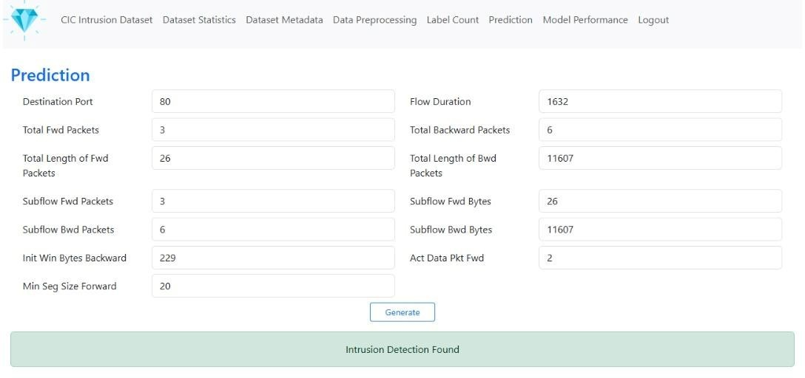
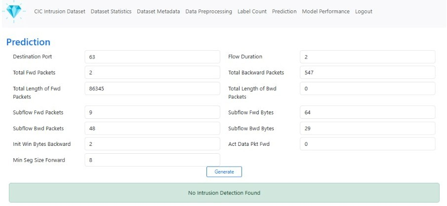

# 🛡️ Network Intrusion Detection System

> **Turning network traffic into meaningful security insights through Machine Learning.**

A Machine Learning-based **Network Intrusion Detection System** to analyze network traffic and identify potential intrusion patterns.

---

👥 Team Project

This project was developed as a team project, where we collaborated on exploring the network intrusion detection workflow, machine learning approach, data analysis, and web application implementation.

Working as a team helped us gain practical experience in collaboration, problem-solving, and applying Machine Learning to a real-world cybersecurity problem.

> **From network traffic to intelligent detection.**

---

## 🧠 Machine Learning Approach

The project uses a **Deep Double Q-Network (DDQN)** approach with a **meta-adaptive reward mechanism** for the intrusion detection workflow.

The overall process follows:

**Network Traffic → Preprocessing → Feature Analysis → Model Processing → Detection → Prediction**

---

## 🧰 Built With

### 🐍 Python

Used for the machine learning workflow, data processing, and application logic.

### 🌐 Flask

Used to build the web application and connect the prediction workflow with the interface.

### 🤖 Scikit-learn

Used for machine learning and data processing operations.

### 📊 Seaborn

Used to create visualizations for exploring network traffic and model results.

### 🔌 REST API

Used to connect prediction functionality with the web application.

### 📁 CIC-IDS2017

The dataset used for studying network traffic and intrusion patterns.

---

## 📸 Project Showcase

### 🏠 Home


### 🎯 Prediction





---

## 📂 Project Structure

```text
CIC-IDS2017-DS-Flask/
│
├── src/
│   ├── CIC-IDS2017-DS-Server.py
│   │
│   ├── static/
│   │   └── Auto-Encoder-Decoder.keras
│   │
│   └── templates/
│       ├── Home.html
│       ├── Dashboard.html
│       ├── DataPreprocessing.html
│       ├── DatasetInfo.html
│       ├── Statistics.html
│       ├── ClassCount.html
│       ├── ModelPerformance.html
│       └── Prediction.html
│
└── README.md
```

---

## 🌟 Key Highlights

* Machine Learning-based intrusion detection
* CIC-IDS2017 dataset analysis
* DDQN-based learning approach
* Meta-adaptive reward mechanism
* Data preprocessing and visualization
* Model performance analysis
* Flask-based interactive interface
* Network traffic prediction workflow

---

## 📚 What we Learned

Exploring this project helped us understand how **Machine Learning can be applied to network security problems** and how a machine learning workflow can be connected to a web application.

It strengthened us exposure to **Python, data preprocessing, machine learning, visualization, Flask, REST APIs, and model evaluation**.

---
